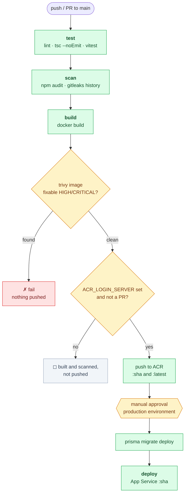

# WhaleChat

A minimal, local-first chat client for the DeepSeek API.

Chats and messages live in your browser's IndexedDB. The API key lives in
`.env.local` and is read **server-side only** — it never reaches the browser.

## Getting started

```bash
npm install
cp .env.example .env.local     # then fill it in — see the comments in the file
./start_local.sh
```

`start_local.sh` stops any running containers, brings up Postgres and Redis,
applies migrations, and starts the dev server on <http://localhost:3000>. Get a
DeepSeek key at <https://platform.deepseek.com>.

On a fresh database the app has no administrator, so every route sends you to
**`/onboarding`** to claim it — see [First run](#first-run). Nothing is seeded
and no admin credentials live in `.env`.

Mail goes out through [Resend](https://resend.com). `RESEND_API_KEY` is optional
for local work — leave it unset and the license key, verification and
password-reset links are printed to the server console instead of being sent,
which is enough to walk through every flow without an account.

> Because the key is read by a server route, this app needs a Node server —
> `npm run build && npm start`, or the [Dockerfile](Dockerfile). It cannot be
> exported as a static site.

## How it works

- **New chat** opens a session immediately, with no form. It titles itself from
  your first message.
- Each chat row has a **⋯ menu** to rename or delete it; renaming also lets you
  switch model and set a per-chat system prompt.
- Requests go from the browser to `/api/chat`, which adds the key and forwards
  to DeepSeek. The browser never talks to `api.deepseek.com` directly.

## Auth

[Better Auth](https://better-auth.com), self-hosted: Postgres through Prisma for
the records, Redis for sessions, Resend for the mail. The screens are
[Better Auth UI](https://better-auth-ui.com) components, installed from its shadcn
registry into `components/auth/` — regenerate them with `npx shadcn@latest add
@better-auth-ui/auth`, don't hand-edit them.

Every view lives on one route, `app/auth/[path]/page.tsx`: `/auth/sign-in`,
`/auth/sign-up`, `/auth/forgot-password`, `/auth/reset-password`,
`/auth/verify-email`, `/auth/sign-out`.

> For the invariants behind all this — why authorization is split between
> `proxy.ts` and the pages, what the three `banned` states mean, and which
> "simplifications" are security holes — see
> [docs/architecture.md](docs/architecture.md).

### First run

There is no seeded admin and no admin credentials in the environment. The app
asks the database whether an administrator exists, and if none does, every route
redirects to `/onboarding`:

1. **Claim** — enter an email. The app creates the administrator and emails a
   **license key** to that address.
2. **Activate** — enter the key. Setup is finished, and that key *is* the
   administrator's password. Change it later under account settings.

If the process is interrupted, `/onboarding` resumes at step 2 — the half-claimed
admin is stored banned with the reason *"Onboarding not completed"*, which also
stops it signing in through the API. From there you can resend the key (which
replaces it, so older emails stop working) or discard the pending admin and start
again with a different address.

> ⚠️ **Claim it before you expose it.** There is no setup token by design, so on
> an unclaimed database the first visitor to reach `/onboarding` becomes the
> administrator. The window closes permanently once step 2 completes, and
> onboarding never re-opens on a database that has been used.

### Getting in

Once an administrator exists, signing up is open but *using* the app is not. A
new account has to clear two gates:

1. **Confirm the email.** Sent on sign-up — or printed to the server console when
   `RESEND_API_KEY` is unset.
2. **Be approved.** Every sign-up is created banned, with the reason
   *"Awaiting administrator approval"*. Sign-in answers
   *"Your account is awaiting administrator approval."* until an admin clears it.

### The admin portal

`/admin`, linked from the user menu for admins. Approve or revoke access, switch
someone between `user` and `admin`, add a pre-approved user, sign a user out
everywhere, impersonate them, or delete them.

Authorization is enforced in `app/admin/page.tsx`, not in `proxy.ts` — Next's
proxy runs without database access, so it can only tell whether *a* session
cookie exists, never whose or what role it carries. The same split applies to the
chat: `proxy.ts` does the cheap optimistic redirect, and `app/page.tsx` plus
`app/api/chat/route.ts` do the real `getSession` check, so a forged cookie gets
past the redirect but not past the page.

### Schema changes

The schema is hand-written in `prisma/schema.prisma`. Adding a Better Auth plugin
usually adds columns; `npx @better-auth/cli generate` will tell you which. Then:

```bash
npx prisma migrate dev --name <what-changed>
```

## Settings, hardcoded

Everything is a constant in `lib/deepseek.ts` — there is no settings UI:

| Setting | Value |
|---|---|
| Models | `deepseek-v4-flash` (default), `deepseek-v4-pro` |
| Temperature | `1.3` — DeepSeek's recommendation for conversation |
| `max_tokens` | omitted, so the model runs to its own limit |
| History | full conversation sent every request, never trimmed |

Both models have a 1M-token context window, which is why there is no
summarization or context-window management to configure.

## Rendering

GitHub-flavored markdown, syntax-highlighted code blocks, KaTeX math
(`$$x^2$$`), and Mermaid diagrams (```mermaid fences).

## Scripts

| Command | Description |
|---|---|
| `./start_local.sh` | Everything below, in order, from a cold machine |
| `npm run dev` | Development server |
| `npm run build` | Production build (regenerates the Prisma client first) |
| `npm start` | Serve the production build |
| `npm run lint` | ESLint |
| `npm run typecheck` | `next typegen` then `tsc --noEmit` |
| `npm test` | Vitest, once |
| `npm run test:watch` | Vitest in watch mode |
| `npm run db:migrate` | Apply pending migrations |
| `npm run db:generate` | Regenerate the Prisma client |

Services come from [docker-compose.yml](docker-compose.yml): Postgres on 5432 and
Redis on 6379. Neither holds state worth keeping — `docker compose down -v` and a
re-run of `./start_local.sh` rebuilds both.

To run the app itself in a container:

```bash
docker compose --profile prod up --build
```

> The image build fetches Prisma's schema engine from `binaries.prisma.sh`. On a
> network that inspects TLS it fails with *"self-signed certificate in
> certificate chain"*; mount the proxy's root CA and set `NODE_EXTRA_CA_CERTS`.
> The finished image never contacts it again — Prisma 7 reaches Postgres through
> the `pg` driver adapter, with no engine binary at all.

## CI/CD

[`.github/workflows/ci-cd.yml`](.github/workflows/ci-cd.yml) runs on every push
and pull request to `main`:



Everything down to the image scan runs with no Azure account. The two diamonds
are where it stops early; the hexagon is the human gate.

| Job | What it does | Needs Azure? |
|---|---|---|
| `test` | `npm ci`, `next typegen`, lint, `tsc --noEmit`, `vitest run` | no |
| `scan` | `npm audit --audit-level=high`, Gitleaks over the full history | no |
| `build` | Builds the image and exports it as an artifact | no |
| `scan-image` | Trivy scans that artifact | no |
| `push` | Loads it, tags and pushes to ACR — `main` only | **yes** |
| `deploy` | Applies migrations, deploys to App Service — behind approval | **yes** |

The image is Trivy-scanned in its own job *before* `push` runs, so a vulnerable
build never reaches the registry.

**Azure is optional to start with.** Everything up to and including `scan-image`
runs without an Azure account — only `push` and `deploy` are gated on
`ACR_LOGIN_SERVER` being set. Until you set it you get a fully green
pipeline that builds and scans the image and then stops, with a notice saying
so. Setting that one variable is what switches shipping on.

`build` and `scan-image` run on pull requests too: a broken Dockerfile or a newly
published CVE is worth catching before merge. `push` never runs on a PR.

Action versions are pinned to a major (`@v7`), which picks up patches
automatically, and [`dependabot.yml`](.github/dependabot.yml) opens a weekly PR
when a new major, base image or npm release lands.

[`codeql.yml`](.github/workflows/codeql.yml) is separate. It runs free on this
public repo; it is isolated so that, were the repo ever made private without
GitHub Code Security, its failure could not block a deploy.

> Full stage-by-stage detail, including why each scanner threshold is set where
> it is, is in [docs/ci-cd.md](docs/ci-cd.md).

### Before it can run

1. **Push the repo** to <https://github.com/Whale-Chat-Org/whalechat>. Nothing runs
   until the first push.
2. **Create a `production` environment** with required reviewers under Settings →
   Environments. `environment: production` in the YAML is *not* the gate on its
   own — without reviewers configured, deploy runs unreviewed.
3. **Set the placeholders** under Settings → Secrets and variables → Actions:

   Variables — `AZURE_CLIENT_ID`, `AZURE_TENANT_ID`, `AZURE_SUBSCRIPTION_ID`,
   `ACR_LOGIN_SERVER`, `ACR_REPOSITORY`, `AZURE_WEBAPP_NAME`,
   `AZURE_RESOURCE_GROUP`, `NEXT_PUBLIC_APP_URL`

   Secret — `DATABASE_URL`

4. **Azure side:** an ACR, a Linux container App Service, and an app
   registration with a federated credential for this repo, holding `AcrPush` on
   the registry and `Website Contributor` on the app.
5. **Set the runtime env vars in App Service** — `BETTER_AUTH_SECRET`,
   `DATABASE_URL`, `REDIS_URL`, `DEEPSEEK_API_KEY`, `RESEND_API_KEY`,
   `EMAIL_FROM`. None of these are in the image.

Two things to know: `NEXT_PUBLIC_APP_URL` is **baked into the image at build
time**, so an image cannot be promoted between environments — staging needs its
own build. And the migrate step runs from a GitHub-hosted runner, so it needs
network access to Postgres; a database behind a private endpoint needs a
firewall rule or a self-hosted runner.

## Contributing

`main` is trunk-based: always releasable, worked on through short-lived branches
merged by pull request. Commit conventions, branch naming and the attribution
rule are in [docs/git.md](docs/git.md).

Agent instructions start at [AGENTS.md](AGENTS.md), which indexes
[`docs/`](docs/).

## Stack

Next.js 16 (App Router), React 19, Tailwind CSS 4, shadcn/ui, Zustand and
localforage on the front; Better Auth, Prisma 7, Postgres and Redis behind it.

Two pins are deliberate: `typescript@^6` and `eslint@^9`. TypeScript 7 is not yet
supported by `typescript-eslint`, and ESLint 10 breaks the `eslint-plugin-react`
bundled in `eslint-config-next`. Both can be raised once those catch up.

## License

MIT — see [LICENSE](LICENSE). Originally forked from
[0xarchit/ByokChat](https://github.com/0xarchit/ByokChat).
