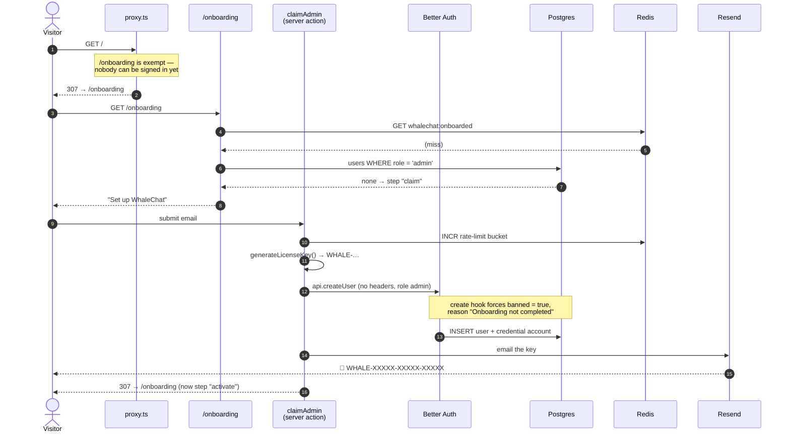
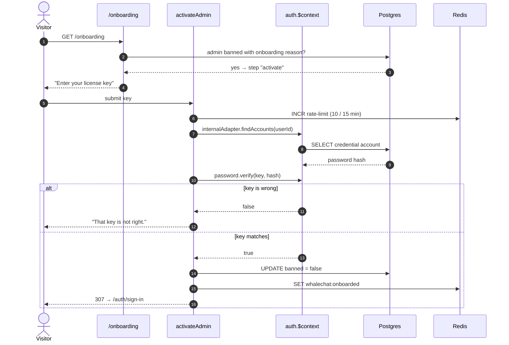
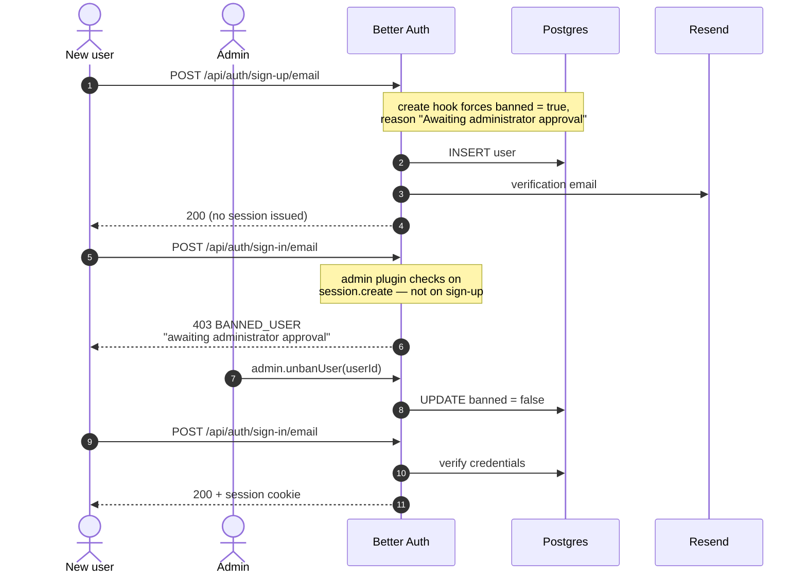
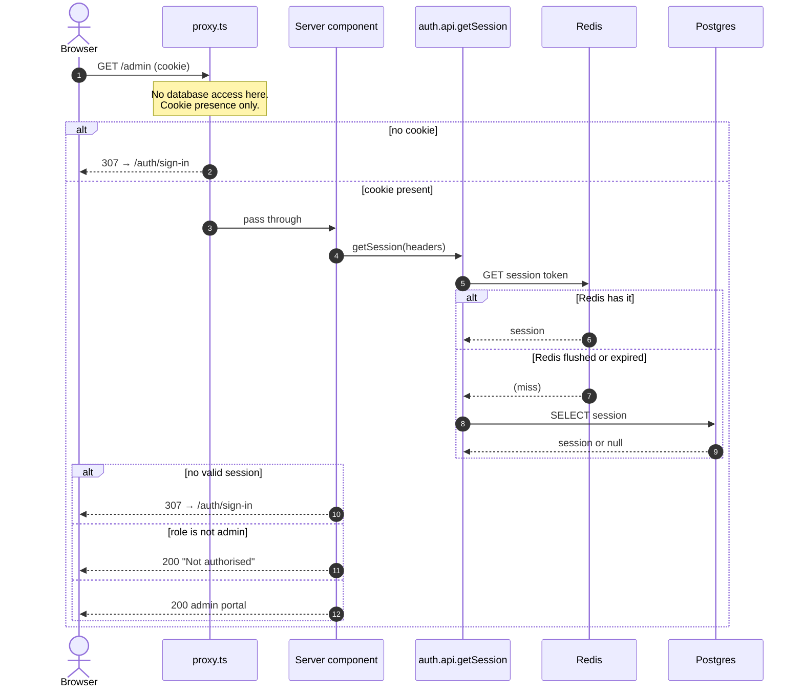

# Architecture

A DeepSeek chat client with a self-hosted auth module. Two storage systems, split
on purpose:

- **Chats and messages** live in the browser's IndexedDB (`lib/db.ts` via
  localforage, driven by `store/chatStore.ts`). They never reach the server.
- **Auth only** lives in Postgres (Prisma 7), with Redis as secondary storage for
  sessions. Postgres holds nothing else.

The DeepSeek API key is read server-side only, in `app/api/chat/route.ts`.

## The auth surface

[Better Auth](https://better-auth.com) with
[Better Auth UI](https://better-auth-ui.com) screens. Every view lives on one
route, `app/auth/[path]/page.tsx` — `/auth/sign-in`, `/auth/sign-up`,
`/auth/forgot-password`, `/auth/reset-password`, `/auth/verify-email`,
`/auth/sign-out`.

`/admin` is linked from the user menu for administrators: approve or revoke
access, switch someone between `user` and `admin`, add a pre-approved user, sign
a user out everywhere, impersonate them, or delete them.

## Sequences

### First run — claiming the instance

### First run — activating

### Everyone else — sign up, wait, be approved

### Every authenticated request

The last diagram is why the two layers cannot be swapped: `proxy.ts` sees only
the cookie, so a stale one gets past it — and the page, which can actually check,
is where the decision is made.

## Authorization is layered, and the layers are not interchangeable

`proxy.ts` is Next 16's renamed middleware. It runs **without database access**,
so it can only tell whether *a* session cookie exists — never whose, nor what
role it carries. Every real check lives in the page or route handler
(`lib/session.ts` → `getServerSession`, `isAdmin`).

The asymmetry in `proxy.ts` is load-bearing: a **missing** cookie is safe to act
on, a **present** one proves nothing. Redis runs with persistence off, so a
restart leaves valid-looking cookies pointing at sessions that no longer exist.
Bouncing those users off `/auth/*` in the proxy creates an unbreakable redirect
loop — `/` redirects to sign-in, the proxy redirects back, forever. That decision
belongs in `app/auth/[path]/page.tsx`, where the session can actually be verified.

`/onboarding` is exempt from the proxy's redirect for the same reason: nobody can
be signed in before the first administrator exists.

## Access control rides on the `banned` column

`lib/access.ts` holds the ban-reason strings and is deliberately free of server
imports, so client components can use them too. Three states share one column:

| `banReason` | Meaning |
|---|---|
| `PENDING_APPROVAL_REASON` | Signed up, waiting for an admin |
| `ONBOARDING_PENDING_REASON` | The first admin, mid-setup |
| `REVOKED_REASON` | Approved once, taken away |

**Do not "simplify" the `databaseHooks.user.create.before` hook in `lib/auth.ts`.**
`banned: true` is forced unconditionally and must stay that way. The admin plugin
declares that field with `defaultValue: false`, so a sign-up reaches the hook with
an explicit `banned: false` already stamped on it. Rewriting the line as
`user.banned ?? true` reads that default as intent and lets **every registration
straight through the approval gate** — it looks like a tidy-up and is a security
hole. Only `banReason` (which has no default) is safely overridable; that is how
onboarding marks its own user.

## First-run onboarding

`lib/onboarding.ts` derives three states from existing data — there is no
dedicated column: no admin → `claim`, an admin banned with the onboarding reason
→ `activate`, an unbanned admin → `done`. A license key is emailed, becomes the
administrator's password, and is verified through `auth.$context.password.verify`.

Two things that look simplifiable and are not:

- If admins exist but **all** of them are banned for other reasons, the state is
  `done`, not `claim`. Reopening would turn "ban the last admin" into a
  takeover. Pinned by a test in `lib/onboarding.test.ts`.
- `getOnboardingState()` calls `connection()` before anything else. Without it, a
  build against a database with no admin prerenders the redirect to
  `/onboarding` into a *static* page, which then redirects there forever — long
  after setup finished.

An interrupted setup resumes at step 2. From there the key can be resent (which
replaces it, so older emails stop working) or the pending admin discarded to
claim again with a different address — both only while onboarding is incomplete.

> ⚠️ **Claim it before you expose it.** There is no setup token by design, so on
> an unclaimed database the first visitor to reach `/onboarding` becomes the
> administrator. The window closes permanently once step 2 completes, and
> onboarding never re-opens on a database that has been used.

Once an administrator exists, sign-up is open but *using* the app is not. A new
account clears two gates: confirm the email, then be approved from `/admin`.

## Generator-owned directories — do not hand-edit

`components/ui/`, `components/auth/` and `lib/auth/` are written by
`npx shadcn@latest add` and overwritten wholesale on the next run. They are
excluded in `eslint.config.mjs` for exactly that reason. Regenerate rather than
patch.

The shadcn style is **`new-york-v4`** (`components.json`). The legacy `default`
style 404s on the `combobox` item that better-auth-ui's sign-up view depends on.

Note that `lib/auth.ts` (our server config) and `lib/auth/` (generated) both
exist. TypeScript resolves the file before the directory, so `@/lib/auth` is ours.

## Things that bite

- **Prisma 7 has no query engine.** `lib/prisma.ts` must pass a driver adapter
  (`@prisma/adapter-pg`). Its transaction timeout is raised to 20s because Better
  Auth wraps a whole endpoint — the deliberately slow password hash *and* the
  outbound email — in a single transaction.
- **`sendMail` never throws** (`lib/email.ts`). Auth sends mail inside the
  transaction that writes the user, so throwing would roll the sign-up back and
  lose the account as well as the email. Undeliverable mail is logged with its
  link instead, which is also how local development works with no
  `RESEND_API_KEY`.
- **Resend's `onboarding@resend.dev` only delivers to the account owner.** Every
  other recipient is refused until a domain is verified at resend.com/domains;
  those links appear in the server console instead.
- **`NEXT_PUBLIC_APP_URL` is inlined into the client bundle at build time**, so
  an image is tied to one origin and cannot be promoted between environments — a
  staging deploy needs its own build.
