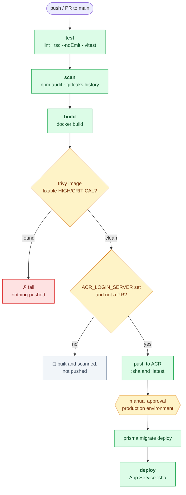

# CI/CD

`.github/workflows/ci-cd.yml` runs on every push and pull request to `main`.

| Stage | Needs Azure? |
|---|---|
| `test` — lint, typecheck, vitest | no |
| `scan` — `npm audit --audit-level=high`, gitleaks over full history | no |
| `build` — docker build, then Trivy scans the image | no |
| ↳ push steps — tag and push to ACR, `main` only | **yes** |
| `deploy` — migrate, then App Service, behind approval | **yes** |

**Azure is optional to start with.** Everything through the image scan runs
without an account; only the push steps and `deploy` are gated on
`ACR_LOGIN_SERVER` being set. Until then the pipeline is green and emits a notice
saying the image was built and scanned but not pushed.

`build` runs on pull requests too — a broken Dockerfile or a newly published CVE
is worth catching before merge. The push steps never run on a PR.

## Deliberate choices that look like mistakes

- **Build and push are one job.** Jobs run on separate runners, so splitting them
  would mean shuttling a multi-hundred-megabyte image through an artifact. The
  Trivy step sits between the build and the push, which is the ordering that
  actually matters.
- **The image is tagged locally first** (`whalechat:<sha>`), and only re-tagged for
  the registry when there is one. The ACR name may not exist yet, and `//:sha` is
  not a valid reference.
- **`npm audit --audit-level=high`, not `moderate`.** The tree carries one
  moderate advisory, in `@better-auth/oauth-provider`, which npm installs as a
  non-optional peer of `@better-auth-ui/react`. That plugin is not enabled in
  `lib/auth.ts`, so the affected code never runs.
- **Trivy uses `ignore-unfixed`.** Without it an unpatched CVE in the
  `node:24-alpine` base blocks every deploy with nothing actionable to do.
- **`aquasecurity/trivy-action@v0.36.0`** — with the `v`. That repo tags releases
  `v0.36.0`; the bare form does not resolve.
- **Gitleaks runs as the CLI via Docker**, not `gitleaks-action`. The Action needs
  a paid licence for organisation-owned repos; the CLI is MIT everywhere.
- **CodeQL is a separate workflow** (`codeql.yml`). Code scanning on a private
  repo requires GitHub Code Security, so it fails until the repo is public or on
  a paid plan — and that must never block a deploy.

## Setup

The remote is `https://github.com/lowjungxuan98/whalechat`. Nothing runs until
the first push.

1. **Create a `production` environment with required reviewers** (Settings →
   Environments). `environment: production` in the YAML is not the approval gate
   by itself; without reviewers the deploy runs unreviewed.
2. **Repository variables:** `AZURE_CLIENT_ID`, `AZURE_TENANT_ID`,
   `AZURE_SUBSCRIPTION_ID`, `ACR_LOGIN_SERVER`, `ACR_REPOSITORY`,
   `AZURE_WEBAPP_NAME`, `AZURE_RESOURCE_GROUP`, `NEXT_PUBLIC_APP_URL`.
3. **Repository secret:** `DATABASE_URL`, used only by the migrate step.
4. **Azure:** an ACR, a Linux container App Service, and an app registration with
   a federated credential for this repo holding `AcrPush` on the registry and
   `Website Contributor` on the app. Auth is OIDC — no long-lived secret.
5. **App Service configuration** carries the runtime env: `BETTER_AUTH_SECRET`,
   `DATABASE_URL`, `REDIS_URL`, `DEEPSEEK_API_KEY`, `RESEND_API_KEY`,
   `EMAIL_FROM`. None of these are in the image.

Two constraints worth internalising: `NEXT_PUBLIC_APP_URL` is baked in at build
time, so images cannot be promoted between environments; and the migrate step
runs from a GitHub-hosted runner, so a Postgres behind a private endpoint needs a
firewall rule or a self-hosted runner. That last one is the most likely first
deploy failure.

Action versions are pinned to a major, which picks up patches automatically;
`.github/dependabot.yml` opens a weekly PR when a new major, base image or npm
release lands.
