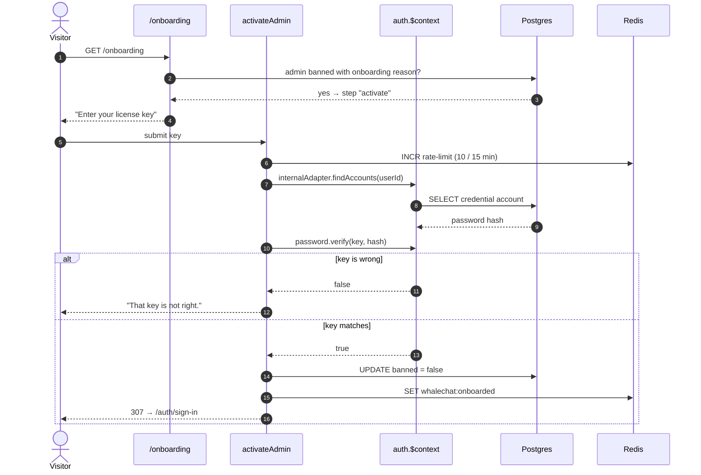

# Activation — the license key

Step 2 of [onboarding](onboarding.md). The instance has been claimed and a key
mailed; entering it proves the claimant can read that mailbox, and opens the app.

**The key becomes the administrator's password.** There is no separate
credential and no expiry — they change it later under account settings.

## Key format

`WHALE-XXXXX-XXXXX-XXXXX`, three groups of five from a 30-symbol alphabet
(`lib/license-key.ts`). That is a little over 73 bits — far past guessing, and
comfortably above Better Auth's 8-character password minimum, which matters
because the key goes on to *be* the password.

The alphabet excludes `0`/`O` and `1`/`I`/`L`. This arrives by email and is
retyped by hand, so the characters people misread are simply not in it.
`normaliseLicenseKey` accepts it lowercased or spaced.

`randomInt` is rejection-sampled by Node, so the distribution stays uniform even
though 30 does not divide evenly into a power of two.

## Verification

The key is never stored in plain text. It exists between generation and the
password hash, and nowhere else — which is also why *resending* has to issue a
new one rather than repeating the old.

`activateAdmin` mirrors Better Auth's own internal `validatePassword`:

```ts
const ctx = await auth.$context;
const credential = (await ctx.internalAdapter.findAccounts(userId))
  .find((a) => a.providerId === "credential");
const ok = await ctx.password.verify({ password: key, hash: credential.password });
```

On success: `banned = false`, `banReason = null`, and the Redis `whalechat:onboarded`
flag is set. The instance is now in state `done` permanently.

## Sequence



## Recovery

Both paths exist only while onboarding is incomplete, and both close at
activation.

**Resend** issues a *new* key and rewrites the password hash, so the key in any
older email stops working. It always goes to the address already on file, which
is why it is safe to leave unauthenticated: the worst an attacker achieves is
mailing the rightful owner a new key.

**Start over** discards the pending administrator so the instance can be claimed
with a different address. It requires typing the claimed address back. That is
not real authentication — it stops a drive-by reset, not someone who knows the
address — but it is consistent with a first-come-wins claim: anyone who could
reset this could equally have claimed the instance first.

## Rate limits

`activateAdmin` is the tight one: **10 attempts per IP per 15 minutes**. It is a
guessable secret reachable without a session. `resendKey` and `startOver` allow 5.
