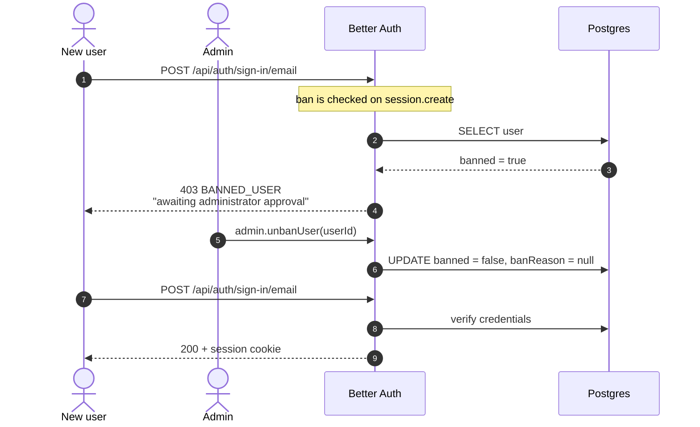

# Approval — the access gate

Signing up is open; using the app is not. Every new account is created banned and
stays that way until an administrator clears it from [`/admin`](admin-portal.md).

## Three states, one column

`lib/access.ts` holds the reason strings. It is deliberately free of server
imports so client components — the admin table, for one — can read them too.

| `banReason` | Meaning | Set by |
|---|---|---|
| `PENDING_APPROVAL_REASON` | Signed up, waiting for an admin | the create hook |
| `ONBOARDING_PENDING_REASON` | The first admin, mid-setup | [onboarding](onboarding.md) |
| `REVOKED_REASON` | Approved once, taken away | an admin |

The admin table derives its Status column from these: *Pending*, *Revoked*, or
*Active* when `banned` is false.

## Enforced on session creation

The admin plugin checks the ban in a `session.create.before` hook, not on
sign-up:

```js
if (user?.banned) {
  throw APIError.from("FORBIDDEN", { message: opts.bannedUserMessage, code: "BANNED_USER" })
}
```

Two consequences worth holding on to:

- Registration succeeds and the *first sign-in* is what fails.
- The gate covers **any** route to a session, including a direct
  `POST /api/auth/sign-in/email` that never passes through the page redirects.
  That is why onboarding leans on the ban rather than a separate column.

It also means the ban is checked once, when the session is made. **Do not add a
`session` block with `cookieCache` to `lib/auth.ts`.** It would put a signed copy
of the session in the cookie for its lifetime, and a ban — like a revoked
permission — would keep working until that copy expired. The absence of that
block is deliberate; see [permissions.md](permissions.md).

Roles are orthogonal to this. A banned user holding every permission still gets
nothing, because no session is ever created for the resolution to attach to.

`bannedUserMessage` is set to *"Your account is awaiting administrator
approval."* — the default wording is about abuse, which is wrong for the
overwhelmingly common case. It is one global string, so a half-claimed
administrator hitting the API sees the approval wording too. Unreachable through
the UI, and not worth a plugin to fix.

## The hook that must not be simplified

```ts
before: async (user) => ({
  data: {
    ...user,
    banned: true,                                        // ← unconditional
    banReason: user.banReason ?? PENDING_APPROVAL_REASON,
  },
}),
```

`banned: true` is forced, and must stay forced. The admin plugin declares that
field with `defaultValue: false`, so a sign-up reaches this hook with an explicit
`banned: false` already stamped on it by `parseInputData`. Rewriting the line as
`user.banned ?? true` reads that default as intent and lets **every registration
straight through the gate**.

It looks like a tidy-up. It is a security hole, and it has already been written
once in this repo and caught by asserting on a normal sign-up's row.

`banReason` has no such default, so an explicit one *does* survive — which is how
onboarding marks its own user without needing a column.

## Sequence


