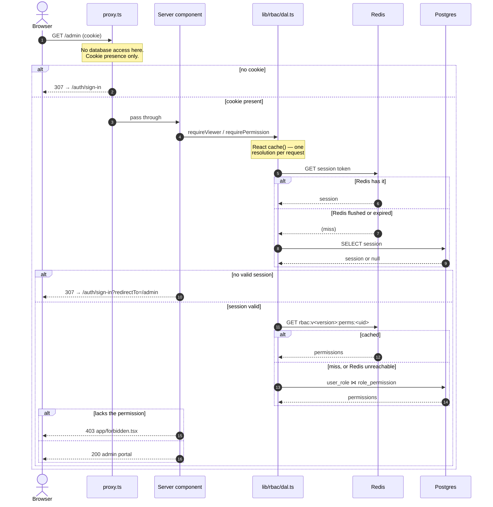

# Authorization

Three layers, and they are **not** interchangeable.

`proxy.ts` is Next 16's renamed middleware. It runs **without database access**,
so it can tell whether *a* session cookie exists and nothing else — never whose,
never what it grants.

The **Data Access Layer** (`lib/rbac/dal.ts`) resolves the session and the
caller's permissions, memoized per request with React's `cache()`. Authorization
lives there rather than at the call sites that need it: a check written next to a
render is a check that can be forgotten on the next page.

The **page or route handler** is the gate. `requirePermission()` in a server
component, `withPermission()` in a route handler. Everything else is decoration.

What each permission means, and how they resolve, is in
[permissions.md](permissions.md).

## The asymmetry is load-bearing

A **missing** cookie is safe to act on: you cannot be signed in without one, so
redirecting to sign-in is always right.

A **present** cookie proves nothing. Redis holds sessions with persistence
deliberately off, so any restart leaves valid-looking cookies pointing at
sessions that no longer exist.

So the proxy only ever acts on absence. Making it act on presence — bouncing
"signed-in" users off `/auth/*` — produced an unbreakable loop: `/` redirected to
sign-in, the proxy redirected back to `/`, forever, with no escape but clearing
cookies by hand. That decision belongs in `app/auth/[path]/page.tsx`, where the
session can actually be verified.

`/onboarding` is exempt from the proxy's redirect for the same family of reason:
nobody can be signed in before the first administrator exists, so sending it to
sign-in would loop against a page that redirects back to onboarding.

## Sequence

## What each route enforces

| Route | Proxy | Real check |
|---|---|---|
| `/` | cookie present | `getServerSession`, redirect if none |
| `/admin` | cookie present | session, then `user:list` |
| `/admin/roles` | cookie present | session, then `role:list` |
| `/auth/*` | always allowed | signed-out-only views validate and send you home |
| `/onboarding` | always allowed | onboarding state; redirects to `/` when done |
| `/api/admin/**` | 401 if no cookie | `withPermission(...)`, per endpoint |
| `/api/chat` | 401 if no cookie | `auth.api.getSession`, plus onboarding state |
| `/api/chats/**` | 401 if no cookie | `withUser` — ownership, not permissions |
| `/api/auth/*` | not matched | Better Auth's own handler |

Chat routes stay on `withUser`. Access to a chat is **ownership**, not
capability: `lib/chats.ts` applies `userId` inside every `where` clause, so
another user's chat id matches zero rows. That is a stronger guarantee than a
permission check, and RBAC does not replace it.

## Denial

`forbidden()` and `unauthorized()` render `app/forbidden.tsx` and
`app/unauthorized.tsx` with real 403 and 401 statuses. They need
`experimental.authInterrupts` in `next.config.ts`, which is on.

Both throw, so they must be awaited on the render path — a call left in an
un-awaited promise throws where nothing catches it and renders no UI at all.
Never wrap one in `try/catch`; that swallows the interrupt.

Check **before anything streams**. A gate inside a `<Suspense>` boundary still
shows the 403 UI, but the response has already committed as a 200 and the status
cannot change afterwards. That is why there is no `app/admin/loading.tsx`.

Pages pass `redirectTo` to `requireViewer` rather than calling `unauthorized()`,
so a stale cookie lands back where the user was aiming after signing in.

`app/admin/layout.tsx` deliberately checks **nothing**. A layout is not an
authorization boundary — it does not re-run when the user navigates between the
pages under it — so each page repeats its own gate.

## Hydration

Server components resolve the session with `ensureSession` from
`@better-auth-ui/react/server` into a per-request `QueryClient`, then wrap the
tree in `HydrationBoundary`. Client components calling `useSession` render
straight from that cache instead of flashing a loading state and refetching.

The gated pages seed the viewer's permissions into the same client from the
already-resolved viewer, so `<Can>` renders the right affordances on first paint
rather than flashing buttons in.

`getOnboardingState()` calls `connection()` first so these routes stay
request-time; see [onboarding.md](onboarding.md).
