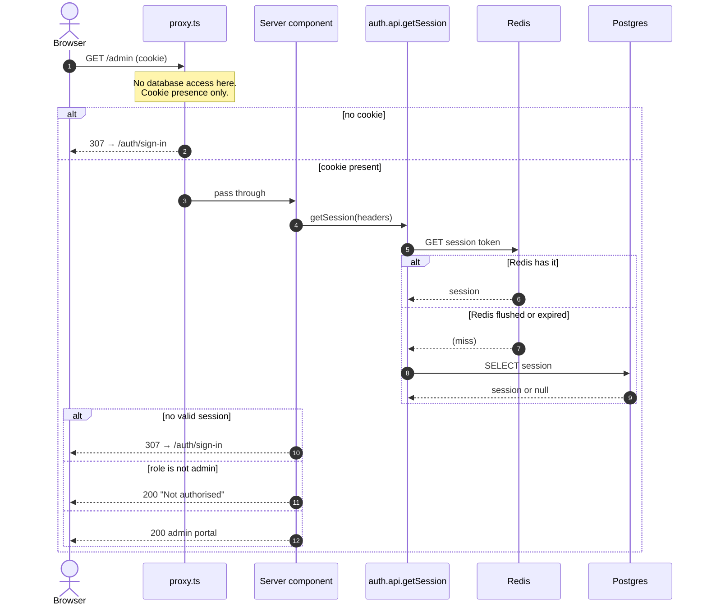

# Authorization

Two layers, and they are **not** interchangeable.

`proxy.ts` is Next 16's renamed middleware. It runs **without database access**,
so it can tell whether *a* session cookie exists and nothing else — never whose,
never what role it carries. Every real check lives in the page or route handler,
through `lib/session.ts` (`getServerSession`, `isAdmin`).

## The asymmetry is load-bearing

A **missing** cookie is safe to act on: you cannot be signed in without one, so
redirecting to sign-in is always right.

A **present** cookie proves nothing. Redis holds sessions with persistence
deliberately off, so any restart leaves valid-looking cookies pointing at
sessions that no longer exist.

So the proxy only ever acts on absence. Making it act on presence — bouncing
"signed-in" users off `/auth/*` — produced an unbreakable loop: `/` redirected to
sign-in, the proxy redirected back to `/`, forever, with no escape but clearing
cookies by hand. That decision belongs in `app/auth/[path]/page.tsx`, where the
session can actually be verified.

`/onboarding` is exempt from the proxy's redirect for the same family of reason:
nobody can be signed in before the first administrator exists, so sending it to
sign-in would loop against a page that redirects back to onboarding.

## Sequence

## What each route enforces

| Route | Proxy | Real check |
|---|---|---|
| `/` | cookie present | `getServerSession`, redirect if none |
| `/admin` | cookie present | session **and** `role === "admin"`, renders 403 otherwise |
| `/auth/*` | always allowed | signed-out-only views validate and send you home |
| `/onboarding` | always allowed | onboarding state; redirects to `/` when done |
| `/api/chat` | 401 if no cookie | `auth.api.getSession`, plus onboarding state |
| `/api/auth/*` | not matched | Better Auth's own handler |

`/admin` renders a "Not authorised" page rather than calling `forbidden()` —
that is still behind an experimental flag — and rather than silently redirecting,
which reads as a broken link.

## Hydration

Server components resolve the session with `ensureSession` from
`@better-auth-ui/react/server` into a per-request `QueryClient`, then wrap the
tree in `HydrationBoundary`. Client components calling `useSession` render
straight from that cache instead of flashing a loading state and refetching.

`getOnboardingState()` calls `connection()` first so these routes stay
request-time; see [onboarding.md](onboarding.md).
