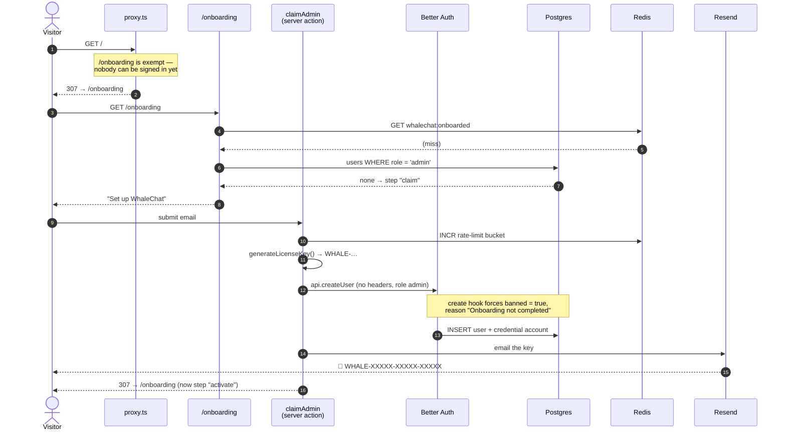

# Onboarding — claiming the instance

There is no seeded admin and no admin credentials in the environment. On a fresh
database nobody administers the app, so every route redirects to `/onboarding`.

Step 1 takes an email, creates the administrator, and mails a **license key**.
Step 2 is [activation.md](activation.md).

> ⚠️ **Claim it before you expose it.** There is no setup token by design, so on
> an unclaimed database the first visitor to reach `/onboarding` becomes the
> administrator. The window closes permanently once activation completes, and
> onboarding never re-opens on a database that has been used.

## The state machine

`lib/onboarding.ts` derives three states from data that already exists — there is
no dedicated column:

| State | Condition | Page shows |
|---|---|---|
| `claim` | no user with `role = "admin"` | "Set up WhaleChat" |
| `activate` | an admin banned with `ONBOARDING_PENDING_REASON` | "Enter your license key" |
| `done` | an admin exists and is not banned | redirects to `/` |

Deriving it rather than adding a column reuses the ban mechanism: a half-claimed
admin is *already* unable to sign in, including through a direct
`POST /api/auth/sign-in/email` that never passes the page redirects.

## Two things that look simplifiable and are not

- **If admins exist but all of them are banned for other reasons, the state is
  `done`, not `claim`.** Reopening would turn "ban the last admin" into a
  takeover, so onboarding never offers itself again on a database that has been
  used. Recovery there is a manual `UPDATE` in psql. Pinned by a test in
  `lib/onboarding.test.ts`.
- **`getOnboardingState()` calls `connection()` first.** Without it, a build
  against a database with no admin prerenders the redirect to `/onboarding` into
  a *static* page — which then redirects there forever, long after setup
  finished.

`done` is cached in Redis under `whalechat:onboarded` because it is monotonic.
Losing Redis just re-queries; the cache never grants anything.

## Sequence

## Why `createUser` and not `signUpEmail`

`auth.api.createUser` is the one admin-plugin endpoint that permits a headerless
server call — it checks `if (!session && (ctx.request || ctx.headers)) throw
UNAUTHORIZED`, so calling it with neither lets the server act on its own
authority. It is also the only way to set `role`, which the admin plugin marks
`input: false`; sign-up can never produce an administrator.

The account is created with `emailVerified: true`. The license key email *is* the
proof of control — onboarding cannot finish without reading that mailbox — so a
separate verification email would ask the same question twice.

## Rate limits

`claimAdmin` allows 5 attempts per IP per 15 minutes
(`lib/rate-limit.ts`, Redis `INCR` + `EXPIRE`). Better Auth's own rate limiter
only covers `auth.handler`, so server actions need their own.
