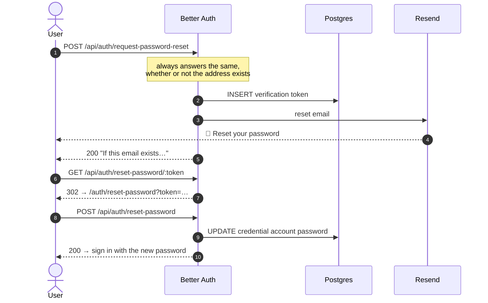

# Password reset

`/auth/forgot-password` → email → `/auth/reset-password`. Standard Better Auth,
wired to Resend through `emailAndPassword.sendResetPassword` in `lib/auth.ts`.

## Flow



The request endpoint answers *"If this email exists in our system, check your
email for the reset link"* either way. That is deliberate — a different response
for unknown addresses turns the endpoint into an account-enumeration oracle.

## Notes

- **The old password stops working immediately** once the reset completes.
- **A pending account can still reset.** Reset does not require approval or
  verification; it only proves mailbox control. The [approval gate](approval.md)
  still blocks the sign-in afterwards.
- **For the bootstrap administrator, this is the escape hatch.** Their password
  is the license key from [activation](activation.md); if it is lost, reset is
  how they get back in without touching the database.
- **Rate limited by Better Auth itself.** `/request-password-reset` carries a
  built-in 3-per-60s rule, unlike the onboarding server actions, which needed
  their own limiter because Better Auth's only covers `auth.handler`.

## Local development

With `RESEND_API_KEY` unset — or with any recipient the `resend.dev` testing
domain refuses — the link is printed to the server console instead of sent:

```
[email] Resend refused it (…) — "Reset your password" was not sent to …
http://localhost:3000/api/auth/reset-password/…
```

That is enough to walk the whole flow without a Resend account.
