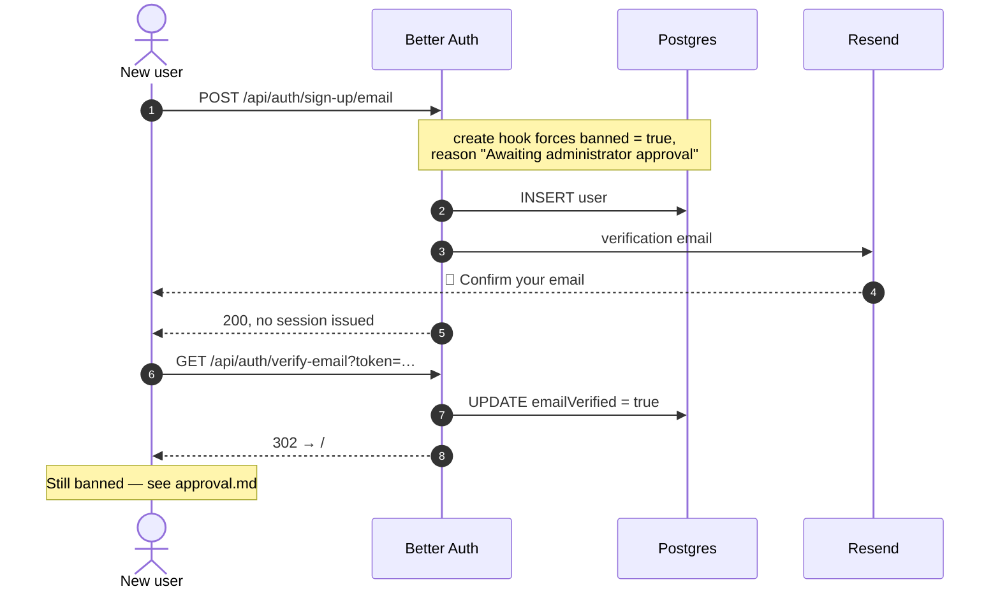

# Sign up

`/auth/sign-up`. Open to anyone once an administrator exists — but registering
and *being able to use the app* are different things. A new account clears two
gates: confirm the email, then be approved. See [approval.md](approval.md).

## What happens

`POST /api/auth/sign-up/email` creates the user and **returns no session**,
because `emailAndPassword.requireEmailVerification` is on. A verification email
goes out through `emailVerification.sendVerificationEmail`.

The `databaseHooks.user.create.before` hook stamps the row `banned: true` with
reason `PENDING_APPROVAL_REASON` on the way in. Registration still succeeds — the
ban is checked when a *session* is created, not when a user is.

That ordering is why sign-up returns 200 to an account that cannot sign in. It is
also why an unverified, unapproved account sits in the database quite happily.

## Sequence

## Email delivery

Mail goes through Resend (`lib/email.ts`). Two things to know:

- **`sendMail` never throws.** Better Auth sends this inside the transaction that
  writes the user, so throwing would roll the registration back and lose the
  account *and* the email. An undeliverable message is logged with its link
  instead.
- **`onboarding@resend.dev` only delivers to the Resend account owner.** Every
  other recipient is refused until a domain is verified at resend.com/domains.
  Those links appear in the server console, which is also how local development
  works with `RESEND_API_KEY` unset.

## Disabling sign-up

`emailAndPassword.disableSignUp` exists in Better Auth if registration should be
admin-only. It is not set here — the approval gate is the control instead, and
`/admin` can create pre-approved users directly. See
[admin-portal.md](admin-portal.md).
